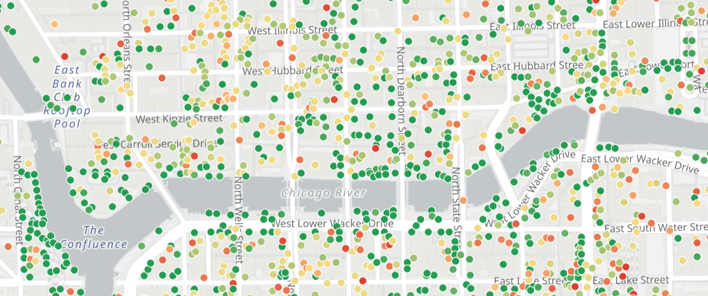

# GERSite — US Building Conflation Pipeline

**GERSite** conflates [Overture Maps](https://overturemaps.org) building footprints,
[FEMA USA Structures](https://www.fema.gov/flood-maps/products-tools/products/building-data),
and the [USACE National Structure Inventory (NSI)](https://www.hec.usace.army.mil/confluence/nsi)
into a single confidence-scored Gold layer GeoParquet, partitioned by H3 cell.

> **Note:** This repository is a fork of [henryspatialanalysis/openpois](https://github.com/henryspatialanalysis/openpois).
> The original OpenPOI pipeline is preserved below and in `src/openpois/`. GERSite code lives
> in `flows/`, `lib/`, `aoi/`, and `config.gers.yaml`.

[](LICENSE)
[](https://opendatacommons.org/licenses/odbl/1-0/)

📐 **Architecture doc:** [`docs/GERSITE_ARCHITECTURE.md`](docs/GERSITE_ARCHITECTURE.md)

---

## GERSite Quick Start (Local)

### Prerequisites

Install [just](https://just.systems/man/en/) (the command runner) and [uv](https://docs.astral.sh/uv/) (package manager):

```powershell
# Windows — install both with winget
winget install Casey.Just
winget install astral-sh.uv
```

Then install GERSite dependencies:

```powershell
just install     # uv sync --extra gers (DuckDB, Prefect, Marimo, H3, …)
just --list      # see all available recipes
```

### Configuration

All settings live in [`config.gers.yaml`](config.gers.yaml).
By default, data is written to `~/data/gers/` (bronze / silver / gold subdirectories).
Change `storage.root` in the config to redirect output, including to an S3 prefix.

### Run the full pipeline for one AOI

```powershell
just run miami_dade     # all three flows for Miami-Dade
just run puerto_rico    # all three flows for Puerto Rico
just run saipan         # smallest AOI — fast smoke test
just run guam
```

Or run individual flows:

```powershell
just ingest miami_dade  # Flow 1 — Bronze ingestion
just bridge miami_dade  # Flow 2 — Silver bridge files
just gold   miami_dade  # Flow 3 — Gold merge & scoring
```

### Supported AOIs

| Key | Area | Shortcut | Notes |
|---|---|---|---|
| `saipan` | Saipan, CNMI | `just run-saipan` | Smallest; fast smoke test |
| `guam` | Guam | `just run-guam` | Small island |
| `puerto_rico` | Puerto Rico | `just run-pr` | Medium US territory |
| `miami_dade` | Miami-Dade County, FL | `just run-miami` | Dense US metro; realistic scale |

### Testing with Miami-Dade and Puerto Rico

These two AOIs are the recommended local test targets — Miami-Dade for a dense US
mainland area and Puerto Rico for a medium-sized US territory:

```powershell
# Miami-Dade County, FL
just run-miami

# Puerto Rico
just run-pr
```

Expected output paths (`~/data/gers/`):
```
bronze/overture/buildings/miami_dade/buildings.parquet
bronze/fema/structures/miami_dade/structures.parquet
bronze/nsi/structures/miami_dade/structures.parquet
silver/bridges/miami_dade/fema_bridge.parquet
silver/bridges/miami_dade/nsi_bridge.parquet
silver/bridges/miami_dade/nsi_unmatched.parquet
gold/buildings/miami_dade/          ← H3-partitioned GeoParquet
gold/nsi_review/miami_dade/         ← unmatched NSI points for review
```

### Interactive notebook mode (Marimo)

Each flow file is also a [Marimo](https://marimo.io) notebook. Open any flow
interactively to explore intermediate results, inspect data, and run individual
tasks without executing the full pipeline:

```powershell
just nb-ingest   # flows/ingest_sources.py
just nb-bridge   # flows/generate_bridges.py
just nb-gold     # flows/produce_gold_layer.py
```

### Read the Gold layer

```python
import pyarrow.dataset as ds
import geopandas as gpd

# Point at the H3-partitioned output directory for one AOI
gold = ds.dataset("~/data/gers/gold/buildings/miami_dade", format="parquet")
print(f"{gold.count_rows():,} buildings")

# Load into GeoPandas (full AOI or filtered)
gdf = gpd.read_parquet("~/data/gers/gold/buildings/miami_dade")
print(gdf[["building_id", "source", "conflation_confidence", "geometry"]].head())
```

### Inspect confidence scores

```python
import pandas as pd
import geopandas as gpd

gdf = gpd.read_parquet("~/data/gers/gold/buildings/miami_dade")
print(gdf["conflation_confidence"].value_counts())
# 1.0 — Overture + FEMA, IoU >= 0.80   (high agreement)
# 0.6 — Overture only                   (no FEMA match)
# 0.3 — FEMA only                       (additive candidate)
```

---

# OpenPOIs

A unified, confidence-scored open dataset of U.S. points of interest, built
from [OpenStreetMap](https://www.openstreetmap.org) and
[Overture Maps](https://overturemaps.org).



[](LICENSE)
[](https://opendatacommons.org/licenses/odbl/1-0/)
[](pyproject.toml)
[](https://github.com/henryspatialanalysis/openpois/actions/workflows/deploy-site.yml)

- 🌐 **Live map:** <https://openpois.org>
- 📘 **Python API docs:** <https://openpois.org/docs/>
- 🗄️ **Dataset on Source Cooperative:** <https://source.coop/henryspatialanalysis/openpois>


## What is OpenPOIs?

OpenPOIs conflates points of interest from OpenStreetMap and Overture Maps
into a single unified dataset, then attaches a per-POI confidence score
estimating the probability that the place still exists. Confidence comes from
a Bayesian turnover model fit on OSM tag-edit history. The published dataset
covers the United States and is refreshed monthly, following the Overture Maps monthly release cycle.

This repository contains the Python library used to produce the data, the
end-to-end pipelines that download and conflate sources, and the Vue
front-end that powers the live map.


## Quickstart — read the data

No install required. The dataset is hosted anonymously on Source Cooperative;
read it straight from S3:

```python
import pyarrow.dataset as ds
import pyarrow.fs as pafs

BASE = "us-west-2.opendata.source.coop/henryspatialanalysis/openpois"
VERSION = "latest"   # or pin a dated folder, e.g. "2026-04-23-v0"

fs = pafs.S3FileSystem(anonymous = True, region = "us-west-2")
pois = ds.dataset(
    f"{BASE}/{VERSION}/conflated-parquet/",
    filesystem = fs,
    format = "parquet",
    partitioning = "hive",
)
print(pois.schema)
print(f"{pois.count_rows():,} POIs")
```

GeoPandas, DuckDB, and PMTiles examples live in the
[dataset README on Source Cooperative](https://source.coop/henryspatialanalysis/openpois).


## Python package

The full OpenPOIs package API — I/O adapters, the turnover model, conflation
primitives — is documented at <https://openpois.org/docs/>.

### Installation

This package can be installed from source:

```bash
git clone https://github.com/henryspatialanalysis/openpois.git
cd openpois
just conda-create        # conda env from environment.yml
conda activate openpois
uv sync                  # install package + dev deps
```

### Repository layout

| Path | Purpose |
|---|---|
| [src/openpois/](src/openpois/) | Library source: I/O, models, conflation, publishing |
| [scripts/](scripts/) | End-to-end pipelines using `config.yaml` |
| [site/](site/) | Vue 3 + Vite frontend powering openpois.org |
| [docs/](docs/) | Sphinx documentation source |
| [tests/](tests/) | Unit tests |

### Reproduce the dataset yourself

The data is produced by four pipelines under [scripts/](scripts/), each
driven by [config.yaml](config.yaml):

1. Snapshot downloads (OSM + Overture)
2. OSM history download and Bayesian turnover-model fit
3. Apply model to OSM snapshot to get per-POI confidence
4. Conflate OSM × Overture, partition, publish to Source Cooperative

Each pipeline and its scripts are documented in the workflows reference at
<https://openpois.org/docs/workflows.html>.

### Web map

The interactive map at <https://openpois.org> is a Vue 3 + Vite app rendering
PMTiles archives over MapLibre GL. To run it locally:

```bash
just site-dev      # http://localhost:5173, hot reload
just site-build    # production build to site/dist/
```

The site auto-deploys to GitHub Pages via
[.github/workflows/deploy-site.yml](.github/workflows/deploy-site.yml) on
every push to `main` that touches `site/`, `src/`, `docs/`, or `scripts/`.

### Development

```bash
just test           # run the test suite
just lint           # flake8 + pylint
just conda-export   # rewrite environment.yml after adding deps
```

## Licensing

OpenPOIs is dual-licensed:

- **Code** — [MIT License](LICENSE). You can use, modify, and redistribute the
  Python package, scripts, and front-end freely.
- **Data** — [Open Database License (ODbL) v1.0](https://opendatacommons.org/licenses/odbl/1-0/).
  The published parquet and PMTiles archives are derivative works of
  OpenStreetMap and Overture Maps and inherit ODbL terms. Any public use must
  attribute OpenPOIs, [OpenStreetMap contributors](https://www.openstreetmap.org/copyright),
  and the [Overture Maps Foundation](https://docs.overturemaps.org/attribution/).
  Derivative databases must be released under the same license.

## Citation

If you use OpenPOIs in research, please cite:

> Henry, N. (2026). *OpenPOIs: a unified, confidence-scored dataset of U.S. points of interest.* Henry Spatial Analysis. <https://openpois.org>

A machine-readable citation is provided in [CITATION.cff](CITATION.cff);
GitHub renders it as a "Cite this repository" button on the repo home page.

## Contact

Bug reports, feature requests, and contributions are welcome via
[GitHub issues](https://github.com/henryspatialanalysis/openpois/issues).
